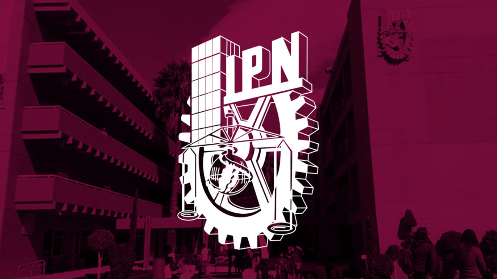

# 
<h1 style="background: linear-gradient(to right, #470522, #710b37, #710b37, #F0F0F0); color: white; font-style: italic; padding: 10px 20px; border-radius: 15px; text-align: left; font-weight:700;">
        Desempeño Académico IPN
</h1> 

# Análisis de los factores que influyen en el desempeño académico de los estudiantes del Instituto Politécnico Nacional dentro de Zacatenco (2024)

## **PRESENTAN**

- Fernando Daniel de la Cruz Carmona (ESCOM) [contacto](http://linkedin.com/in/daniel-c-65186632b)
- José Armando Ramírez Islas (ESCOM) [contacto](https://www.linkedin.com/in/armando-islas) 
- Daniela Grisel Flores Quiroz (ESCOM) [contacto](https://www.linkedin.com/in/dfloresq)
- Armando García Saavedra (ESCOM) [contacto]()
- Carlos Francisco Aguilar Ramírez (ESCOM) [contacto](www.linkedin.com/in/carlos-aguilar-dtsc)

## _Introducción_

El proyecto tiene como objetivo identificar los factores que más peso tienen en el desempeño académico de los alumnos del IPN para proporcionar  a la dirección de cualquier plantel educativo conclusiones accionables.

El proyecto tomó muestras de alumnos de la zona acádemica de Zacatenco, pero puede ser adaptado para cualquier plantel específico.

Las encuestas fueron recopiladas através de la plataforma Google Forms. Los resultados luego fueron cargados mediante distintas APIs que Google Cloud proporciona para facilitar el acceso a los resultados más actualizados.

Al finalizar el proyecto, se obtuvieron las siguientes conclusiones:
- a
- b
- c
- d 

## 🎯 _Objetivos_

- Identificar los factores que tienen mayor impacto en el desempeño académico de los estudiantes del IPN (Zacatenco).

## 📜 _Metodología_

- La metodología incluye los siguientes pasos:  

    1. **Recolección de datos**: Encuestas aplicadas a estudiantes de diferentes planteles del IPN dentro de la zona académica de Zacatenco.

        **Detalles de la Encuesta**
        Las preguntas realizadas en la encuesta (listadas a continuación) tienen el objetivo de reunir potenciales datos relacionados con el desempeño académico. 
        - Las preguntas se estructuraron en tres grupos grandes: 

            **Información general**

            1. ¿A qué escuela perteneces?
            2. ¿Cuál es tu promedio global?
            3. ¿Cuántas materias has reprobado a lo largo de tu trayectoria?
            4. ¿Qué edad tienes?
            5. ¿Cuál es tu género?

            **Factores sociales y económicos**

            6. ¿Tienes dependientes económicos?
            7. ¿Tienes personas a tu cuidado?
            8. ¿Te sientes apoyado por tu familia?
            9. ¿Requieres de apoyos económicos (becas) para sostener tus estudios?
            10. ¿Eres foráneo?
            11. ¿Cuánto tiempo tardas en llegar a tu escuela en minutos?

            **Factores académicos**

            12. ¿Cuántas horas diarias dedicas al estudio fuera de clases?
            13. ¿Cuántas horas trabajas al día?
            14. ¿Padeces alguna enfermedad crónica?
            15. ¿Te gusta tu carrera?
            16. ¿Piensas ejercer la carrera?
            17. ¿Cuántas horas duermes en promedio al día?
            18. ¿Con qué frecuencia utilizas herramientas de IA?

    2. **Procesamiento de datos**: Limpieza, transformación y estructuración de los datos recolectados.  

    3. **Análisis exploratorio de datos (EDA)**: Identificación de patrones, tendencias y anomalías.  

    4. **Modelado predictivo**: Uso de modelos de aprendizaje automático para identificar los factores más influyentes.
        - Redes neuronales
        - Regresión lineal
        - Árboles de decisión
        - XGBoost

    5. **Visualización y reporte**: Presentación de resultados en gráficos y conclusiones accionables.  

### 📊 Exploración y Análisis de Datos

El análisis de los datos incluyó:  

- Estadísticas descriptivas para entender la distribución de las respuestas.  
- Gráficos que representan las tendencias y correlaciones entre las variables.  
- Identificación de outliers.

### 🧹 Limpieza y Transformación de Datos

### ⚙️ Modelado y evaluación

### ✅ Resultados y Conclusiones

*(Este apartado contiene un resumen de los hallazgos más importantes y su interpretación. Por ejemplo:)*  

- Los factores relacionados con hábitos de estudio y acceso a recursos educativos tienen el mayor peso en el desempeño académico.  
- Se identificaron brechas significativas entre planteles en cuanto a recursos disponibles.  

## _Limitaciones_

Una de las principales limitaciones de este trabajo es el tiempo con el que contó para realizar la recopilación de los datos. 
Además, la cooperación de la comunidad politécnica representó un gran desafío, ya que la validez y la consistencia de los datos se ve comprometida en la realización de encuestas de este tipo.

Se sugiere, para futuros trabajos abordar la problemática desde un enfoque distinto, que aporte más seriedad académica al proceso de recopilación de datos con el fin de obtener más datos y de mejor calidad. 

Los resultados aquí presentes podrían tener un gran impacto en el manejo académico de la institución buscando impulsar el desempeño académico de los estudiantes del nivel superior en la zona de Zacatenco.

## _Conclusiones_

## ⚖️ Licencia
Para obtener información sobre la licencia del proyecto visita el archivo [LICENSE](LICENSE)

## Agradecimientos

El proyecto fue realizado por 30 integrantes de la Lic. en Ciencia de Datos, impartida en el Instituto Politécnico Nacional (IPN) todos coordinados por [los miembros líderes](#presentan)